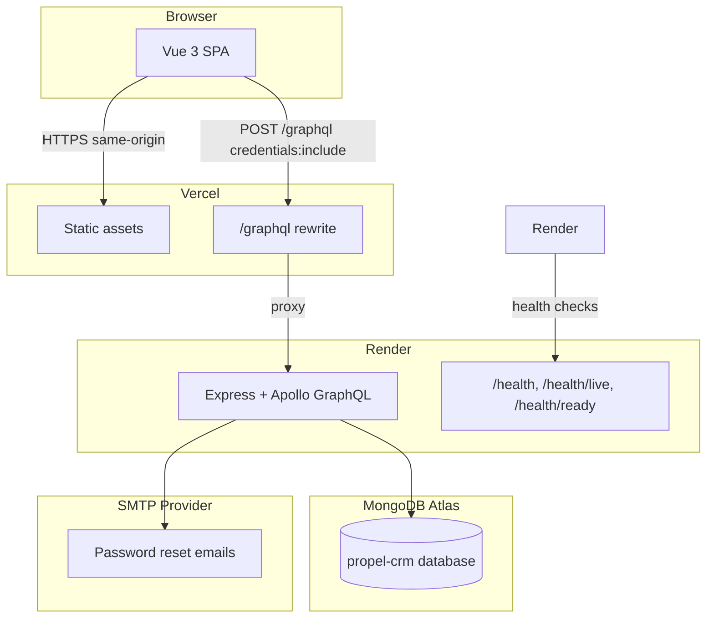
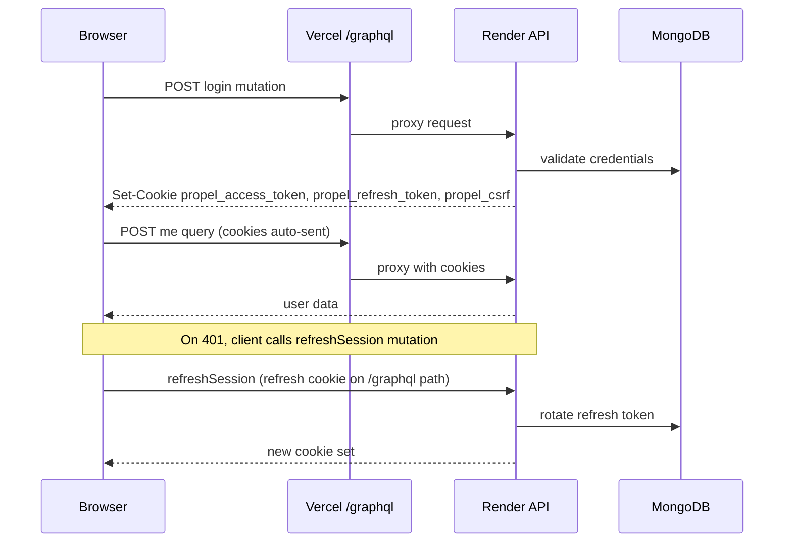

# Propel CRM — Production Deployment Guide

This document describes how to deploy Propel CRM from scratch: Vue 3 frontend on Vercel, Node/Express GraphQL API on Render, and MongoDB Atlas.

---

## Architecture



| Component | Platform | URL pattern |
|-----------|----------|-------------|
| Frontend | Vercel | `https://<your-app>.vercel.app` |
| API | Render | `https://propel-crm-api.onrender.com` |
| Database | MongoDB Atlas | `mongodb+srv://...` |
| GraphQL (browser) | Vercel rewrite | `https://<your-app>.vercel.app/graphql` |
| GraphQL (direct) | Render | `https://propel-crm-api.onrender.com/graphql` |

---

## Deployment Flow

### 1. MongoDB Atlas

1. Create a free cluster at [MongoDB Atlas](https://cloud.mongodb.com).
2. **Database Access** → create a database user with read/write on the `propel-crm` database.
3. **Network Access** → add Render's egress IPs or `0.0.0.0/0` for initial setup (tighten for production).
4. **Connect** → Drivers → copy the connection string:
   ```
   mongodb+srv://<user>:<password>@<cluster>.mongodb.net/propel-crm?retryWrites=true&w=majority
   ```

### 2. Render (Backend API)

1. Connect the GitHub repository.
2. Create a **Web Service** with:
   - **Root directory:** `server`
   - **Runtime:** Node 20+
   - **Build command:** `npm install && npm run build`
   - **Start command:** `npm start`
3. Set environment variables (see [Required environment variables](#required-environment-variables)).
4. Configure **Health Check Path:** `/health/ready`
5. Deploy and note the service URL (e.g. `https://propel-crm-api.onrender.com`).

### 3. Bootstrap super admin

On first deploy, seed the super admin (run locally against Atlas or via Render shell):

```bash
cd server
export SEED_ADMIN_EMAIL=admin@your-domain.com
export SEED_ADMIN_PASSWORD='your-secure-password'
# Production requires explicit confirmation:
export SEED_CONFIRM=yes
npm run seed
```

The first login forces a password change (`mustChangePassword`).

### 4. Vercel (Frontend)

1. Import the GitHub repository.
2. **Framework preset:** Vite
3. **Root directory:** `.` (repository root)
4. **Build command:** `npm run build`
5. **Output directory:** `dist`
6. Set frontend environment variables (see below).
7. Update `vercel.json` rewrite destination to your Render API URL.

### 5. Verify

1. `GET https://propel-crm-api.onrender.com/health/ready` → `200` with `mongodb: up`
2. Open the Vercel app → sign in with seeded admin credentials
3. Change password on first login
4. Confirm GraphQL requests go to `/graphql` on the Vercel domain (Network tab)

---

## Build Process

### Frontend (Vercel)

```bash
npm install
npm run build   # vue-tsc -b && vite build
```

Output: `dist/` static files served by Vercel CDN.

### Backend (Render)

```bash
cd server
npm install
npm run build   # tsc + copy GraphQL schema to dist/
npm start       # node dist/server.js
```

Docker alternative (`server/Dockerfile`):

```bash
cd server
docker build -t propel-crm-api .
docker run -p 4000:4000 --env-file .env propel-crm-api
```

---

## Required Environment Variables

### Backend (`server/` — Render)

| Variable | Required | Example / notes |
|----------|----------|-----------------|
| `NODE_ENV` | Yes | `production` |
| `PORT` | No | `4000` (Render sets automatically) |
| `MONGODB_URI` | Yes | Atlas connection string |
| `JWT_ACCESS_SECRET` | Yes | min 32 chars — `openssl rand -base64 64` |
| `JWT_REFRESH_SECRET` | Yes | min 32 chars — separate from access secret |
| `JWT_ACCESS_EXPIRES_IN` | No | `15m` |
| `JWT_REFRESH_EXPIRES_IN` | No | `7d` |
| `CORS_ORIGINS` | Yes | `https://your-app.vercel.app` (HTTPS only in prod) |
| `DEFAULT_PHONE_COUNTRY_CODE` | No | `254` |
| `SMTP_HOST` | Yes | e.g. `sandbox.smtp.mailtrap.io` or production SMTP |
| `SMTP_PORT` | No | `2525` |
| `SMTP_USER` | Yes | SMTP username |
| `SMTP_PASS` | Yes | SMTP password |
| `EMAIL_FROM` | No | `noreply@propelcrm.com` |
| `PASSWORD_RESET_CODE_TTL_MINUTES` | No | `15` |
| `PASSWORD_RESET_MAX_ATTEMPTS` | No | `5` |

**Seed-only (never commit):**

| Variable | Purpose |
|----------|---------|
| `SEED_ADMIN_EMAIL` | Bootstrap admin email |
| `SEED_ADMIN_PASSWORD` | Bootstrap admin password |
| `SEED_CONFIRM=yes` | Required to seed in production |

### Frontend (Vercel)

| Variable | Required | Production value |
|----------|----------|------------------|
| `VITE_GRAPHQL_URL` | Yes | `/graphql` (recommended with Vercel rewrite) |

**Local development (`.env`):**

```env
VITE_GRAPHQL_URL=/graphql
VITE_API_PROXY_TARGET=http://localhost:4000
```

---

## Render Configuration

| Setting | Value |
|---------|-------|
| Root directory | `server` |
| Build | `npm install && npm run build` |
| Start | `npm start` |
| Health check path | `/health/ready` |
| Health check interval | 30s (default) |
| Auto-deploy | On push to main (recommended) |

Render terminates TLS at the edge and forwards `X-Forwarded-Proto: https`. The API sets `trust proxy: 1` and enforces HTTPS redirects in production.

**Free tier note:** Render free services spin down after inactivity. First request after idle may take 30–60 seconds (cold start).

---

## Vercel Configuration

`vercel.json` at the repository root:

```json
{
  "rewrites": [
    {
      "source": "/graphql",
      "destination": "https://propel-crm-api.onrender.com/graphql"
    }
  ]
}
```

Replace the destination with your Render service URL.

**Why the rewrite matters:** The browser sends GraphQL requests to the Vercel origin (`/graphql`). Cookies are set for the Vercel domain without a `Domain` attribute. This keeps auth same-origin and compatible with `SameSite=Strict` cookies.

---

## MongoDB Atlas Setup

1. **Cluster:** M0 free tier is sufficient for demo/small teams.
2. **Database name:** `propel-crm` (set in connection string path).
3. **Collections:** Created automatically by Mongoose on first use (`users`, `contacts`, `refreshtokens`, etc.).
4. **Indexes:** Defined in Mongoose schemas; run `npm run db:migrate` if migration scripts are added.
5. **Backups:** Enable Atlas continuous backup on paid tiers; export manually on free tier before major changes.

**Network access for Render:** Render outbound IPs change on free tier. Use `0.0.0.0/0` initially, then restrict to Render static outbound IPs on paid plans.

---

## Authentication Flow



1. **Login** — `login` mutation validates credentials, sets httpOnly JWT cookies + CSRF cookie.
2. **Session** — Every GraphQL request reads `propel_access_token` cookie; user re-loaded from DB.
3. **CSRF** — Authenticated mutations require `X-CSRF-Token` header matching `propel_csrf` cookie.
4. **Refresh** — On auth failure, frontend calls `refreshSession`; server rotates refresh token in DB.
5. **Logout** — Revokes refresh token in DB and clears all cookies.

Tokens are never returned in JSON bodies or stored in `localStorage`.

---

## Cookie Strategy

| Cookie | httpOnly | Secure | SameSite | Path | Domain | Max-Age |
|--------|----------|--------|----------|------|--------|---------|
| `propel_access_token` | Yes | prod only | Strict | `/` | (host default) | 15m |
| `propel_refresh_token` | Yes | prod only | Strict | `/graphql` | (host default) | 7d / 30d remember |
| `propel_csrf` | No | prod only | Strict | `/` | (host default) | matches refresh |

**No explicit `Domain`** — cookies bind to the host the browser requested.

### Environment suitability

| Setup | Works? | Notes |
|-------|--------|-------|
| **localhost dev** | Yes | Vite proxy makes `/graphql` same-origin; `Secure=false` allows HTTP |
| **Vercel + Render (rewrite)** | Yes | Recommended. Browser sees Vercel origin; cookies set for Vercel domain |
| **Vercel SPA → Render API direct** | No* | Cross-site cookies blocked by `SameSite=Strict` |
| **Same custom domain** | Yes | e.g. `app.example.com` + `api.example.com` still cross-site with Strict |
| **Single domain (app + api)** | Yes | e.g. `example.com` with `/graphql` reverse proxy |

\*Would require `SameSite=None; Secure` and CORS credentials — not currently configured; use Vercel rewrite instead.

---

## CORS Configuration

CORS is applied **only** on `/graphql`:

```typescript
cors({
  origin: corsOrigins,        // from CORS_ORIGINS env
  credentials: true,
  methods: ['GET', 'POST', 'OPTIONS'],
  allowedHeaders: ['Content-Type', 'X-CSRF-Token'],
})
```

| Setting | Value |
|---------|-------|
| Allowed origins | Explicit list from `CORS_ORIGINS` (no wildcard) |
| Credentials | `true` |
| Methods | `GET`, `POST`, `OPTIONS` |
| Headers | `Content-Type`, `X-CSRF-Token` |
| Preflight | Handled automatically by `cors` middleware |

Production validation requires all origins to use `https://`.

**With Vercel rewrite:** Browser requests are same-origin; CORS preflight is not triggered for normal SPA traffic. CORS still matters for direct API access (mobile apps, GraphQL clients, staging tools).

---

## GraphQL Endpoint

| Environment | URL |
|-------------|-----|
| Production (browser) | `https://<vercel-app>.vercel.app/graphql` |
| Production (direct) | `https://propel-crm-api.onrender.com/graphql` |
| Local dev | `http://localhost:5173/graphql` (via Vite proxy) |
| Local API | `http://localhost:4000/graphql` |

**Security:**

- Introspection: **disabled** in production
- GraphQL Playground: **not exposed**
- Query depth limit: **8**
- Request body limit: **512 KB**
- Rate limit: **120 req/min** per IP (production)
- Login: **5 attempts / 15 min**
- Password reset: **3 attempts / hour**

---

## Health Endpoints

| Endpoint | Purpose | MongoDB check |
|----------|---------|---------------|
| `GET /health` | Full operational snapshot | Yes |
| `GET /health/live` | Liveness (process running) | No |
| `GET /health/ready` | Readiness for load balancer | Yes |

Example `GET /health` response:

```json
{
  "status": "ok",
  "service": "propel-crm-api",
  "version": "1.0.0",
  "environment": "production",
  "nodeVersion": "v20.x.x",
  "uptimeSeconds": 3600,
  "timestamp": "2026-06-30T12:00:00.000Z",
  "memory": { "rssMb": 85.2, "heapUsedMb": 42.1 },
  "checks": { "mongodb": { "status": "up", "state": "connected" } }
}
```

No secrets, connection strings, or JWT material are exposed.

Configure Render health check to `/health/ready`.

---

## Production Checklist

### Infrastructure

- [ ] MongoDB Atlas cluster provisioned with dedicated DB user
- [ ] Network access configured for Render
- [ ] Render web service deployed with `NODE_ENV=production`
- [ ] Render health check set to `/health/ready`
- [ ] Vercel frontend deployed with `VITE_GRAPHQL_URL=/graphql`
- [ ] `vercel.json` rewrite points to correct Render URL
- [ ] `CORS_ORIGINS` includes exact Vercel production URL (HTTPS)

### Secrets

- [ ] `JWT_ACCESS_SECRET` and `JWT_REFRESH_SECRET` are unique, 32+ chars
- [ ] Secrets stored in platform env vars, not in git
- [ ] SMTP credentials configured for password reset

### Security

- [ ] Super admin seeded and initial password changed
- [ ] GraphQL introspection disabled (automatic in production)
- [ ] HTTPS enforced on API (Render + `enforceHttps` middleware)
- [ ] Rate limits active (verify 429 on burst)

### Monitoring

- [ ] Render logs streaming enabled
- [ ] Health endpoints responding `200`
- [ ] Login and password reset email flow tested

---

## Common Deployment Issues

### Cookies not persisting after login

**Cause:** Frontend calling Render API directly instead of Vercel `/graphql` rewrite. Cross-site `SameSite=Strict` cookies are not sent.

**Fix:** Set `VITE_GRAPHQL_URL=/graphql` and ensure `vercel.json` rewrite is deployed.

### CORS error on login

**Cause:** `CORS_ORIGINS` does not include the exact frontend origin (scheme + host, no trailing slash).

**Fix:** Set `CORS_ORIGINS=https://your-app.vercel.app` on Render. Redeploy.

### `503` on `/health/ready`

**Cause:** MongoDB connection failed — wrong URI, IP not allowlisted, or credentials invalid.

**Fix:** Verify `MONGODB_URI`, Atlas network access, and database user permissions.

### Cold start timeout (Render free tier)

**Cause:** Service spun down after 15 minutes idle.

**Fix:** Upgrade to paid plan, use an uptime ping on `/health/live`, or accept cold-start delay.

### CSRF errors (`403 CSRF_INVALID`)

**Cause:** Mutation sent without `X-CSRF-Token` header, or cookies cleared.

**Fix:** Ensure `credentials: 'include'` on fetch; login again to refresh CSRF cookie.

### Password reset emails not sent

**Cause:** Invalid SMTP credentials or blocked port.

**Fix:** Verify `SMTP_*` env vars; use Mailtrap for staging, production SMTP for live.

### `Production CORS origin must use HTTPS` on startup

**Cause:** `CORS_ORIGINS` contains `http://` with `NODE_ENV=production`.

**Fix:** Use `https://` origins only in production.

---

## Troubleshooting

### Check API health

```bash
curl -s https://propel-crm-api.onrender.com/health | jq
curl -s https://propel-crm-api.onrender.com/health/ready | jq
```

### Test GraphQL (no auth)

```bash
curl -s -X POST https://propel-crm-api.onrender.com/graphql \
  -H 'Content-Type: application/json' \
  -d '{"query":"{ __typename }"}'
```

In production, introspection is disabled — use a known public mutation like `login` for testing.

### View structured logs (Render)

Render dashboard → Service → Logs. Look for JSON entries:

```json
{"level":"info","message":"Request completed","meta":{"method":"POST","path":"/graphql","status":200,"durationMs":45.2,"graphqlOperation":"login"}}
```

### Verify Vercel rewrite

```bash
curl -s -o /dev/null -w "%{http_code}" \
  -X POST https://your-app.vercel.app/graphql \
  -H 'Content-Type: application/json' \
  -d '{"query":"{ __typename }"}'
```

### Local reproduction

```bash
# Terminal 1 — API
cd server && npm run dev

# Terminal 2 — Frontend
npm run dev

# .env
VITE_GRAPHQL_URL=/graphql
VITE_API_PROXY_TARGET=http://localhost:4000
```

---

## Rollback Procedure

### Frontend (Vercel)

1. Vercel dashboard → Deployments
2. Find the last known-good deployment
3. Click **⋯** → **Promote to Production**
4. Rollback is near-instant (static assets only)

### Backend (Render)

1. Render dashboard → Service → **Events** or **Manual Deploy**
2. Deploy a previous commit from the connected branch:
   - Option A: `git revert` the bad commit on main and push (auto-deploy)
   - Option B: Render → Manual Deploy → select previous commit SHA
3. Verify `/health/ready` returns `200`
4. Test login flow on production frontend

### Database

Schema changes are forward-only via Mongoose. To roll back data:

1. Restore from Atlas backup (paid tier) or pre-migration export
2. Re-run seed only on empty database (`SEED_CONFIRM=yes`)

**Do not** roll back JWT secrets without invalidating all sessions — users will need to re-login.

### Emergency: disable API

Render → Service → **Suspend** to stop traffic while investigating. Frontend will show network errors.

---

## Related Files

| File | Purpose |
|------|---------|
| `vercel.json` | Frontend GraphQL proxy |
| `server/.env.example` | Backend env template |
| `.env.example` | Frontend env template |
| `server/Dockerfile` | Container build |
| `server/src/server.ts` | Express app entry |
| `server/src/utils/auth-cookies.ts` | Cookie configuration |
| `server/src/config/env.ts` | Env validation |

---

## Support Contacts

- **Render status:** https://status.render.com
- **Vercel status:** https://www.vercel-status.com
- **MongoDB Atlas status:** https://status.mongodb.com
